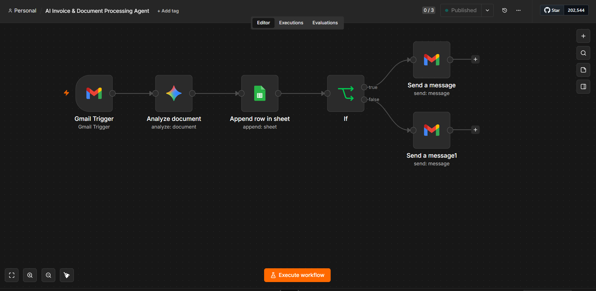
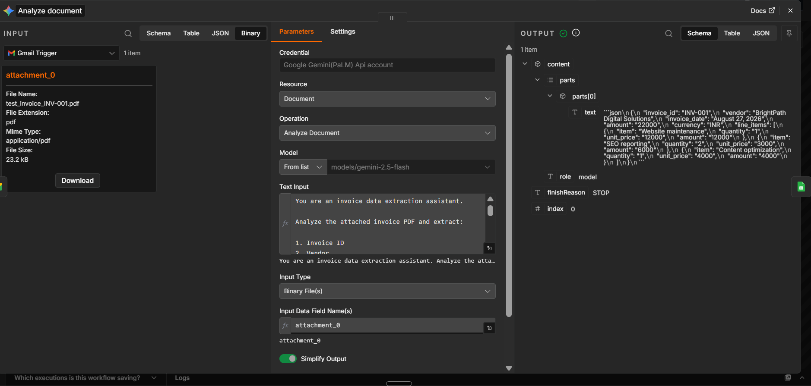
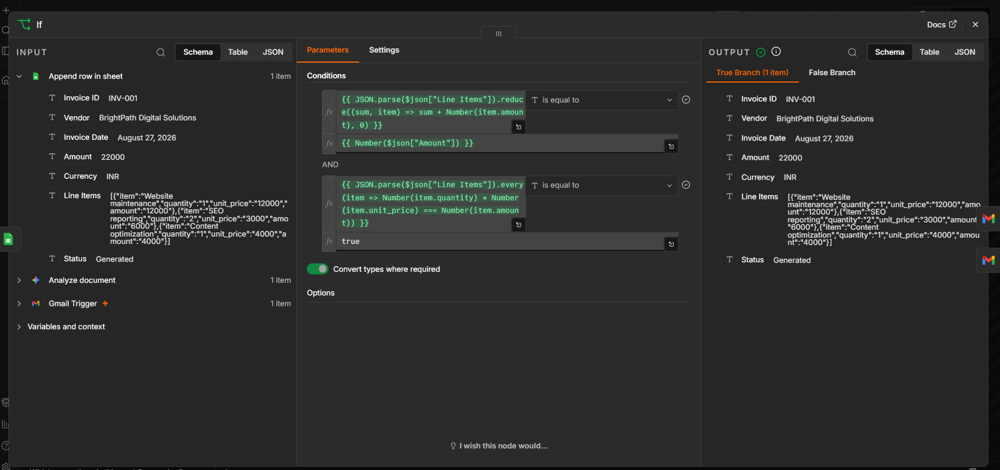

# AI Invoice & Document Processing Agent

An AI-powered n8n automation that receives invoice emails, extracts structured invoice data from PDF attachments using Google Gemini, stores the results in Google Sheets, validates invoice calculations, and sends automated email notifications.

## Workflow

Gmail Trigger → Analyze Document (Google Gemini) → Google Sheets → IF Validation → Success/Review Email

## Workflow Screenshot



## AI Invoice Extraction

The workflow uses Google Gemini to analyze PDF invoice attachments and extract structured information including:

- Invoice ID
- Vendor
- Invoice Date
- Amount
- Currency
- Line Items



## Invoice Validation

Before sending the final notification, the workflow performs two validation checks:

- Compares the sum of line-item amounts with the invoice total.
- Verifies `Quantity × Unit Price = Line Item Amount` for every line item.
- Routes valid invoices to the success email.
- Routes failed validation to the review email.



## Features

- Detects invoice emails with attachments.
- Processes PDF invoice documents using Google Gemini.
- Extracts structured invoice information.
- Stores processed invoices in Google Sheets.
- Validates invoice totals automatically.
- Validates individual line-item calculations.
- Sends success notifications for valid invoices.
- Sends review notifications for invoices that fail validation.
- Runs automatically through an n8n Gmail trigger.

## Technologies

- n8n
- Google Gemini
- Gmail
- Google Sheets
- JSON

## Setup

1. Import `ai-invoice-processing-agent.json` into n8n.
2. Re-select your Gmail, Google Gemini, and Google Sheets credentials.
3. Configure the destination Google Sheet.
4. Configure the notification email address.
5. Test the workflow with an invoice PDF.
6. Publish/activate the workflow.

> The GitHub workflow file has been sanitized. Credentials, personal email addresses, private spreadsheet identifiers, and instance-specific metadata are not included.

## Example

A sample invoice is processed and validated by comparing its invoice total with the sum of its line items.

For example:

```text
Website maintenance       ₹12,000
SEO reporting              ₹6,000
Content optimization       ₹4,000
--------------------------------
Invoice Total             ₹22,000
The workflow confirms that:

₹12,000 + ₹6,000 + ₹4,000 = ₹22,000

It also verifies the calculation of each individual line item before routing the invoice.

Security

Never commit API keys, OAuth tokens, passwords, private webhook URLs, or other credentials to GitHub.

Use n8n credentials or environment variables for sensitive information.

Future Improvements
Duplicate invoice detection
Vendor-specific validation rules
OCR fallback for scanned invoices
Invoice approval workflows
Slack or Microsoft Teams notifications
Invoice analytics dashboard
Automatic storage of processed invoice PDFs
